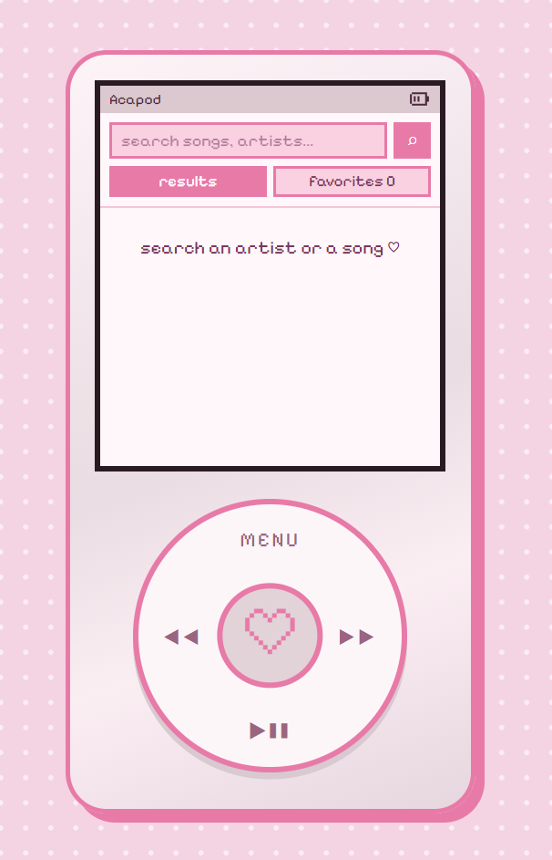

<h1 style="color:e87aa8;">🎧 Acapod</h1>

A small retro-inspired music player designed around the idea of an iPod for acapella music.

<h2 style="color:#e87aa8;">✨ About</h2>

AcaPod is a front-end web project that recreates the feeling of using a simple music player, with a soft retro/pixel-inspired interface.

The project was created to practice building interactive UI components and working with audio controls using React, CSS, and JavaScript.

<h2 style="color:#e87aa8;">🎵 Features</h2>

- ▶️ Play and pause songs
- ⏮️ Previous / next track controls
- 🎚️ Audio progress bar
- ❤️ Favorite button
- 📱 iPod-inspired interface
- 🌸 Soft retro/pixel aesthetic

<h2 style="color:#e87aa8;">🛠️ Built With</h2>

- React
- CSS3
- JavaScript
- Youtube Data API

<h2 style="color:#e87aa8;">📸 Preview</h2>

<h2 style="color:#e87aa8;">📂 Project Structure</h2>
acapod
├─ .oxlintrc.json
├─ index.html
├─ package-lock.json
├─ package.json
├─ public
│  ├─ favicon.svg
│  └─ icons.svg
├─ README.md
├─ src
│  ├─ App.jsx
│  ├─ assets
│  │  ├─ heart-empty.png
│  │  ├─ heart-filled.png
│  │  ├─ hero.png
│  │  ├─ react.svg
│  │  └─ vite.svg
│  ├─ components
│  │  ├─ ClickWheel.jsx
│  │  ├─ Menu.jsx
│  │  ├─ NowPlaying.jsx
│  │  ├─ SongRow.jsx
│  │  └─ StatusBar.jsx
│  ├─ data.js
│  ├─ index.css
│  ├─ main.jsx
│  └─ youtube.js
└─ vite.config.js